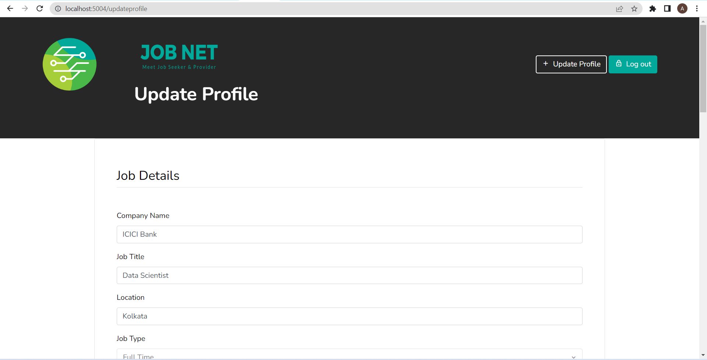

# **JobNet – A Job Recommender System**

🚀 An intelligent web-based platform designed to recommend the most relevant job opportunities to users based on their profiles and preferences.

## 📌 Features

- **User Profile Creation 👤**: Allows users to create and manage their profiles with details like skills, education, and experience.
- **Web Scraping for Job Data 🌐**: Uses Selenium to gather live job postings from multiple online sources.
- **TF-IDF Vectorization 📊**: Converts job descriptions and user profiles into numerical feature vectors for analysis.
- **Cosine Similarity Matching 📏**: Measures the similarity between user profiles and job descriptions to find the best matches.
- **Personalized Job Recommendations 🎯**: Suggests job roles most aligned with the user's profile.
- **Interactive Job Search Interface 🔍**: Allows users to browse and filter job recommendations.

## 🛠️ Technologies Used

- **Python**: Core programming language for backend logic and data processing.
- **Selenium**: For automated web scraping of job postings and user profile data.
- **Scikit-learn**: For implementing TF-IDF vectorization and cosine similarity.
- **HTML, CSS, JavaScript**: For the front-end design and interactivity.

## 📸 Screenshots  

| Screenshot 1 | Screenshot 2 | Screenshot 3 |
|--------------|--------------|--------------|
|  |  |  |

| Screenshot 4 | Screenshot 5 | Screenshot 6 |
|--------------|--------------|--------------|
|  |  |  |

| Screenshot 7 | Screenshot 8 |
|--------------|--------------|
|  |  |
